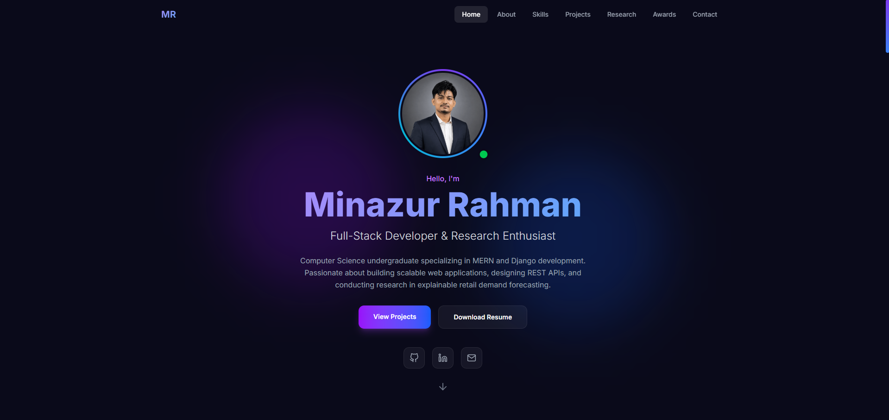

# Portfolio — Minazur Rahman

A fast, accessible, and responsive personal portfolio built with React and Vite to showcase projects, skills, and contact information.

---

## Table of contents
- [About](#about)
- [Demo](#demo)
- [Features](#features)
- [Technologies](#technologies)
- [Getting started](#getting-started)
- [Project structure](#project-structure)
- [Scripts](#scripts)
- [Deployment](#deployment)
- [Customizing / Updating Content](#customizing--updating-content)
- [Contributing](#contributing)
- [License](#license)
- [Contact](#contact)

---

## About

This repository contains the source code for my personal portfolio website. The site presents a concise bio, selected projects with links and descriptions, a summary of my technical skills, and ways to contact me. It's built with a modern front-end stack (React + Vite) and styled with Tailwind CSS.

The site's HTML entry (index.html) includes a page title and description:
"Minazur Rahman | Full-Stack Developer & Research Enthusiast" — use this README to find how to run and deploy the project.

## Demo

Live demo: https://minazur-rahman.vercel.app/

Screenshot



## Features
- Clean, responsive layout (mobile-first)
- Project gallery / portfolio section with project descriptions and links
- Smooth UI animations using Framer Motion
- Iconography via react-icons
- Fast dev experience via Vite
- Linting with Oxlint

## Technologies
- React
- Vite
- Tailwind CSS
- Framer Motion
- react-icons

These are listed in package.json as dependencies and devDependencies.

## Getting started

Prerequisites
- Node.js (recommended: latest LTS)
- npm (or yarn)

1. Clone the repository

```bash
git clone https://github.com/MinazurRahman/portfolio.git
cd portfolio
```

2. Install dependencies

```bash
npm install
```

3. Start the dev server

```bash
npm run dev
```

Open http://localhost:5173 (or the address printed by Vite) to see the site.

4. Build for production

```bash
npm run build
```

5. Preview the production build locally

```bash
npm run preview
```

## Scripts
The following npm scripts are available (defined in package.json):
- npm run dev — start Vite dev server
- npm run build — produce a production build
- npm run preview — locally preview the production build
- npm run lint — run Oxlint

## Project structure
A high-level view of the repository:

- index.html — app entry (title & meta)
- package.json — project metadata, dependencies, and scripts
- vite.config.js — Vite configuration
- public/ — static assets (favicon, images)
- src/ — React source files (components, pages, styles)

Adjust these if your structure changes.

## Deployment
This project includes a vercel.json file and is configured for easy deployment on Vercel.

Recommended hosting options:
- Vercel — connect the repository and deploy from the main branch (auto-deploys on push)
- Netlify — build command: `npm run build`, publish directory: `dist`
- GitHub Pages — you can deploy the built `dist` folder using a branch or a deployment action

## Customizing / Updating Content
- Update text in the React components inside `src/` to change your bio, projects, and contact info.
- Replace images in `public/` and update their references in the code.
- Tailwind: edit the Tailwind config (if present) or the CSS files to change theme, colors, spacing.

## Contributing
This is my personal portfolio. If you'd like to suggest improvements, please open an issue or a pull request. For larger changes, open an issue first to discuss the idea.

## License
This repository currently has no license specified. Add a LICENSE file (for example, MIT) if you want to make the project open source.

## Contact
Minazur Rahman — https://github.com/MinazurRahman

If you'd like me to add an email address or social links to this README, tell me the preferred contact information and I will update it.
